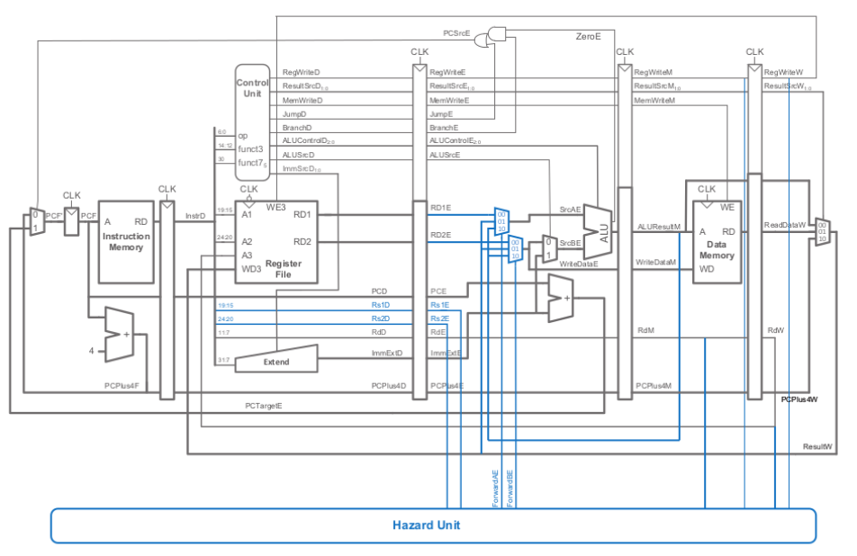

# RISC-V-Pipeline-Architecture
This project implements a RISC-V processor with a pipeline architecture that supports arithmetic, store, and load instructions. It effectively manages structural and data hazards to optimize execution.  

### 5-Stage Pipeline Implementation
The processor follows five-stage pipeline architecture,The stages include:  
**Instruction Fetch (IF):** Fetches the instruction from memory.  
**Instruction Decode (ID):** Decodes the instruction and reads necessary registers.  
**Execute (EX):** Performs arithmetic and logic operations.  
**Memory Access (MEM):** Accesses memory for load/store operations.  
**Write Back (WB):** Writes the computed results back to the register file.  

### Supports Arithmetic, Store,and Load Instructions
This processor supports:  
**Arithmetic operations:** Addition, subtraction, and logical operations like AND and OR.  
**Load operations:** Loading data from memory into registers.  
**Store operations:** Writing register data back to memory.  

### Structural and Data Hazard Management
To ensure smooth execution, the processor includes:  
**Structural Hazard Handling:** Resolves conflicts when multiple instructions compete for the same hardware resources.  
**Data Hazard Detection & Forwarding:** Implements forwarding mechanisms to bypass intermediate results directly to dependent instructions, reducing unnecessary stalls.
